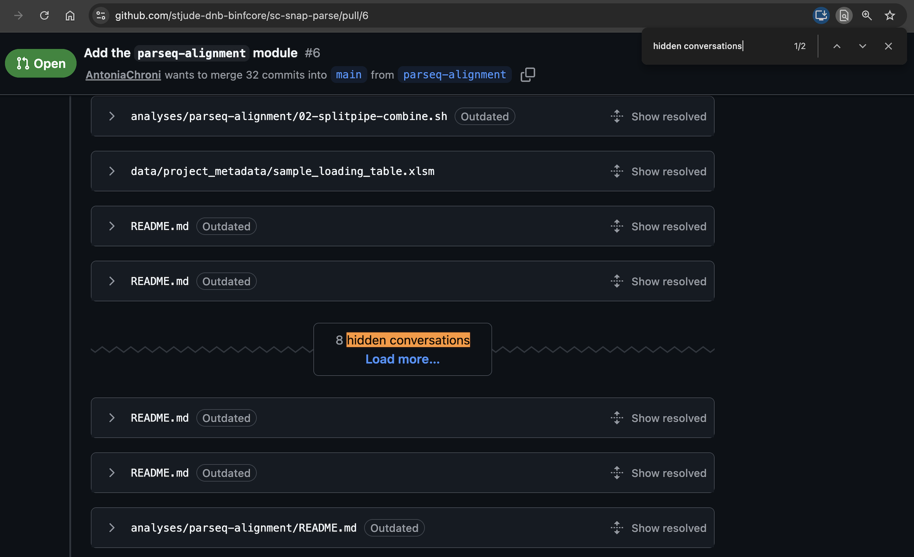
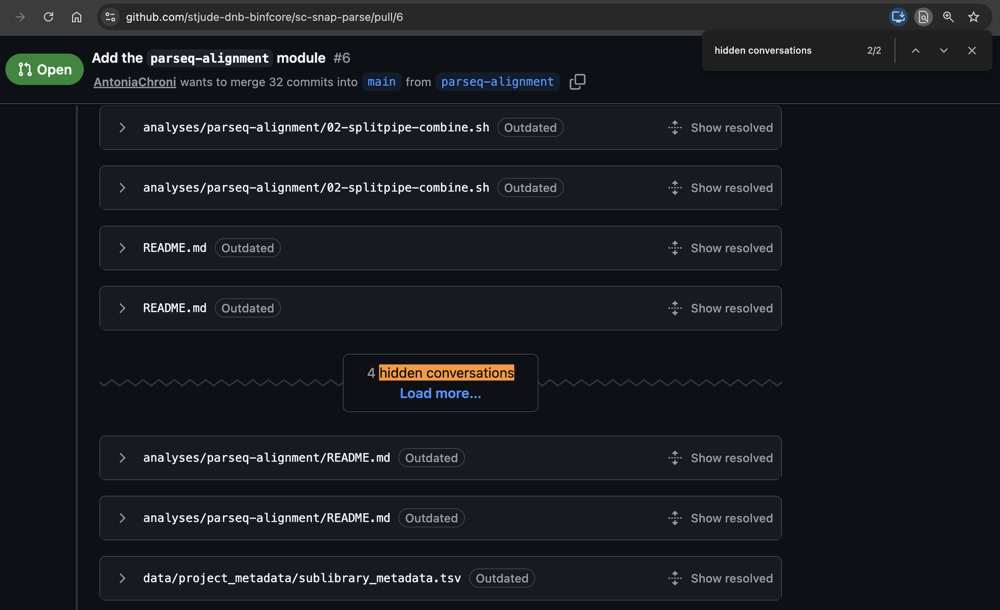
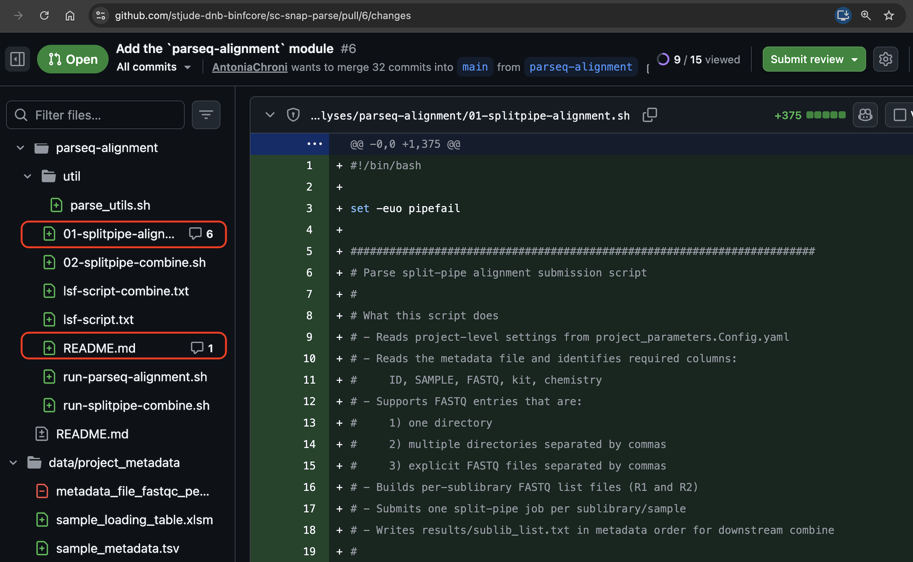

# 📌 How to Check for Hidden Comments on GitHub

When you are working on a PR review, it is important to check to see if there are any hidden comments on the PR page, both as an author and as a reviewer.

There is a known behavior on GitHub where some comments may automatically be hidden, particularly on longer reviews. This leads to comments potentially being missed when authors are responding to reviews and when reviewers are checking that comments have been addressed before approving PRs. This appears to be a known complaint with GitHub that hasn't been addressed currently, based on community discussions (e.g. [here](https://github.com/orgs/community/discussions/112603) and [here](https://github.com/orgs/community/discussions/130618)).
 
To account for this issue, there are two ways you can double check for any hidden comments on a PR review.

### 1. Search the main PR page for the phrase "hidden conversations". 

The screenshot below provides an example of what it looks like to have a hidden comments section on a PR reivew.

**Make sure to check for additional hidden comments sections**. If there has been more than one round of reviews on a PR, there may be multiple spots where there are hidden comments on a PR page.

### 2. Check for comment counts next to files on the `Files changed` page.

If a file has any comments that have not been resolved, there will be a comment symbol and a count corresponding to the number of unresolved comments next to the file name on the `Files changed` page. Before requesting a re-review (as an author), merging a PR (as an author), or approving a PR (as a reviewer), check to make sure there are no unresovled comments that still need to be addressed.

The screenshot below provides an example of what these comment counts will look like on the `Files changed` page.

---

#### Authors

Sharon Freshour, PhD ([@sharonfreshour](https://github.com/sharonfreshour))

---

*These materials have been developed by the [DNB Bioinformatics core team](https://www.stjude.org/research/departments/developmental-neurobiology/shared-resources/bioinformatic-core.html) at the [St. Jude Children's Research Hospital](https://www.stjude.org/). These are open access materials distributed under the terms of the [BSD 2-Clause License](https://opensource.org/license/bsd-2-clause), which permits unrestricted use, distribution, and reproduction in any medium, provided the original author and source are credited.*